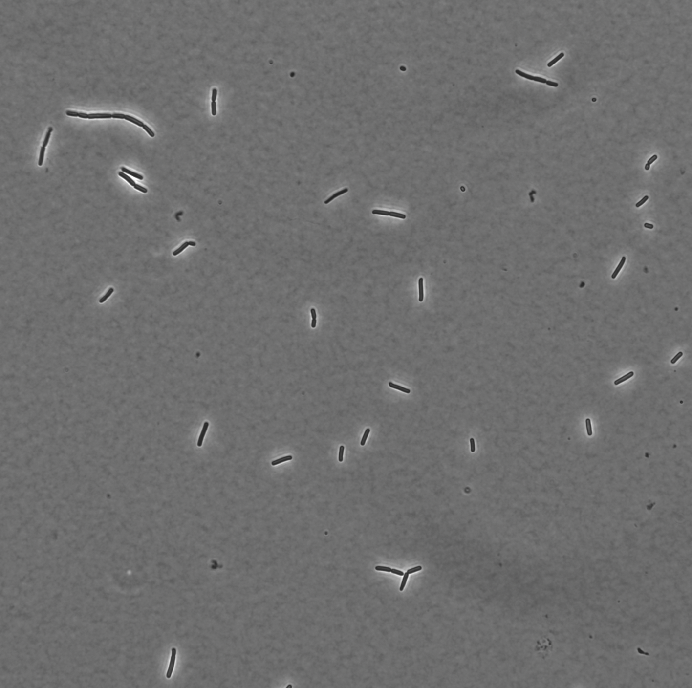

# PhaseIV

# Components 

## Param search component

* Finds the best parameter for canny edge detection for microscopic images.

**Raw image**

**Total area fluctuation by param1 of the cv2.canny() method.**

